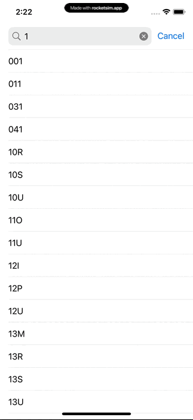

# Swifty Proteins

---

## Table of Contents

- [Context](#context)
- [Goal](#goal)
- [Features](#features)
- [Technologies Used](#technologies-used)
- [Installation](#installation)
- [Usage](#usage)
- [Screenshots](#screenshots)

## Context

This project was developed as part of the Swift development course at [42](https://www.42.fr/42-network/). The goal was to build an iOS app that displays 3D ligands models using SceneKit.

## Goal

The goal of the project was to build an iOS app that displays 3D protein models using SceneKit.

## Features

The key features of the app include:

- Sign up and log in
- Log in with Face ID or Touch ID
- Search for ligands
- Display 3D models of ligands
- Display information about ligands and atoms
- Share screenshots of the 3D models

## Technologies Used

- Swift
- SwiftUI
- SceneKit
- UIKit
- Lottie
- SwiftLint

## Installation

To install the project on your local machine:

1. Clone the repository
2. Open it in Xcode
3. Change the bundle identifier to your own
4. Build the project and run on an emulator or device

## Usage

To use the app:

1. Sign up or log in
2. Search for a ligand or select one from the list
3. Play with the 3D model
4. Share a screenshot of the 3D model

## Screenshots

### Login view

### Search model view

### Model view

### Share view

---
